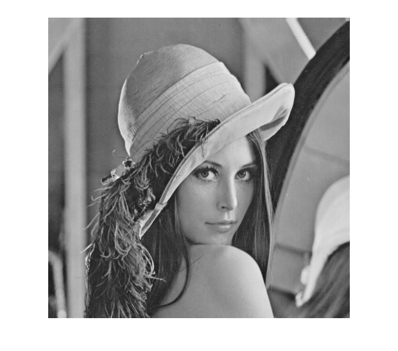
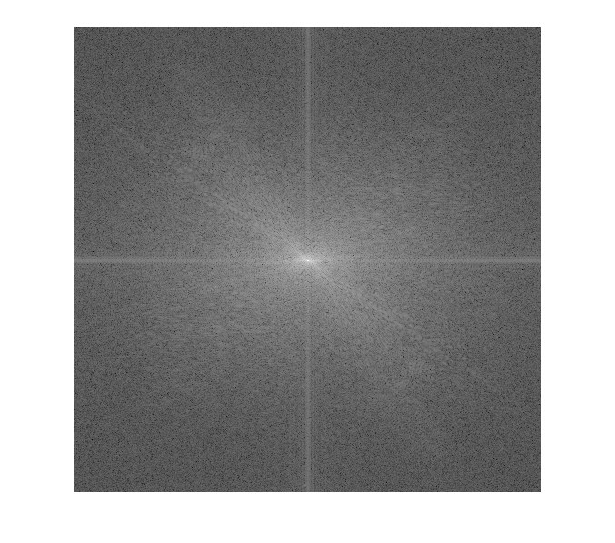
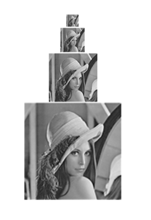
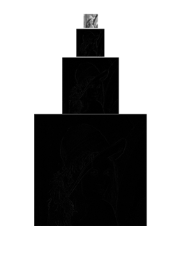
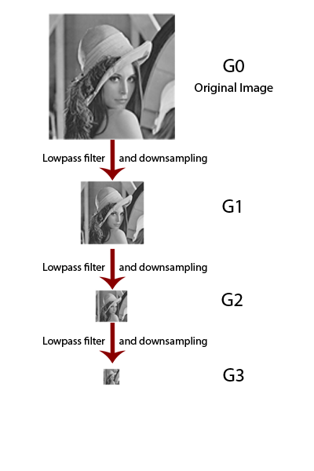
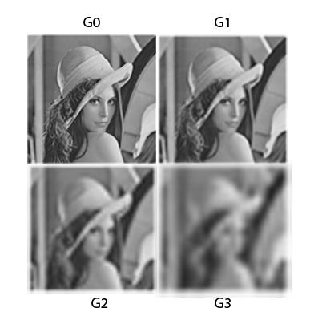
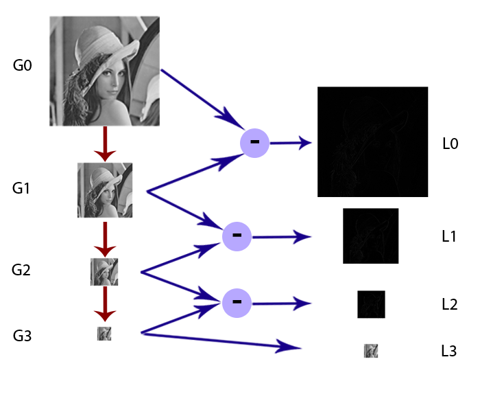
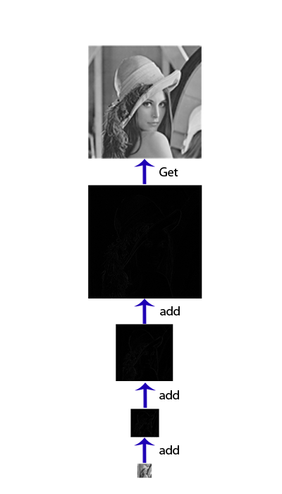

_2020 remark:
This article was first published in 2011 under the name [Image Pyramid](https://rorasa.wordpress.com/2011/02/26/image-pyramid/)._

What is the Image Pyramid? Of course it has nothing to do with the ancient Egypt. Image Pyramid-formally called “pyramid representation of image”- is a image and signal processing technique, to represent a single image using a set of cascading images. Image pyramid provides many useful properties for many application, such as noise reduction, image analysis, image enhancement, etc.

## Why we need these Pyramids?

Images that we can see in everyday life are represented using so-called **Spatial domain**, which is actually the things that most people will think of when talk about images. This spatial domain represents images by the luminance values of each image’s location.
There are many processing operations that can be done with the spatial domain, such as basic low-pass filter and high-pass filter, adaptive filter, median filter, and many other things end with filter. Normally most of these filters work by using local information from each location. However, since images mostly contain complex informations, sometimes they are hard works to process in spatial domain.

There is another popular type of image representation known as the **frequency domain**. If we perform the Fast Fourier Transform to the image, we will get the totally different image called frequency spectrum. For those who didn’t know about the frequency domain, let’s simply explain like this: From the signal theory, every signal (including image, of course) can be express as a linear combination of a set of various-frequency sine and cosine signals. The process to transform from normal signal to frequency domain is called Fourier Transformation, and the transformed result – in this case, frequency spectrum- is actually a set of coefficients of each sine and cosine signals. In our case, low frequency represents smooth details, shapes, and colour in the image, and high frequency represents fine details and noise in the image.

The introducing of frequency domain make more possibility for image processing. For example, we can just discard the high frequency responses to remove most noises from the image! Sounds great except that the beautiful object edge also gone with the noises. A major problem of frequency domain is that it will mix all frequency from every object in the image together, formally called “_loss of locality_”, and most of the time we don’t want to mix our faces’ beautiful details with the detail of the grass in background.

In order to get the advantages of both spatial domain and frequency domain, the new representation is invented and called **spatial-frequency domain**. This new domain give us the ability to deal with separate frequency easily as well as preserve the locality of the information. Our image pyramid is also in this domain.

## What is exactly this Pyramid?

The image pyramid is actually a representation of the image by a set of the different frequency-band images . For example, if we put our original Lena image to construct her pyramid, we may get, for simplicity, 3 layers of pyramid. The first image will represent low frequency band (smooth detail), the second image will represent middle frequency band (some detail), and the last image will represent high frequency band (finest detail). Image Pyramid is also called “multi-scale” and “multi-resolution” because of this characteristic.

## How to construct this Pyramid?

To construct the pyramid, we have 2 options here. Since we know that the each layer of pyramid represents a different band of image’s frequency, we may use multiple filters, a filter for each band, to convolute with the image. Some of us may already known that just only a single time of convolution will need some effort, do not try to imagine multiple time of it. ( Convolution literally means “things that extremely complicated and difficult to follow”)

Another option is , according to some great-mind persons, instead of using multiple filters to the image, we can use multiple image to convolute with a single filter! The best part is these multiple images are obtains by reducing size of the original image. This way is much better than the first option. So we will use this technique to construct Lena’s pyramid.

We can notice that each pyramid layer is constructed by applying the low-pass filter to the upper part and then reduce its size by the factor of 0.5. This process is called “Reduce operation“. Because each layer of this pyramid is a low-pass filtered image with a different filter range, this pyramid is called “Gaussian Pyramid” or the pyramid of low-pass filtered image.

The Gaussian Pyramid itself still doesn’t have much usefulness. However we can use it to construct another pyramid called “Laplacian Pyramid” or the pyramid of band-pass filtered image. Each layer of this pyramid is made from subtract two consecutive layer from Gaussian Pyramid together. In order to subtract, the lower later need to be upsampled to be the same size to the upper layer, and this process called “Expand operation“.

This Laplacian Pyramid is the true useful member of the image pyramid. Each layer of this pyramid is the band-pass image, which means we can now do some things to the specific frequency just like in the frequency domain. We also see that even after its frequencies are shown, the local features of the image are still there. By using this pyramid we can get the so-called spatial-frequency domain as explained in the beginning.

After we finish our work with this pyramid and need our Lena back, we can just sum every layer of the Laplacian Pyramid together so that we can get back the original image (or result image after we have done something). This process is called “Reconstruction“

In conclusion, the image pyramid is another technique to represent the image. Unlike another domain such as spatial domain and frequency domain, because the image pyramid, which is the spatial-frequency domain, have the advantages of both domain. Moreover, the computation of image pyramid is much easier than that of the frequency domain (Who would like to do the Fourier Transform?)

Reference:

- E.H. Adelsom, et al., “Pyramid Methods in Image Processing“.
