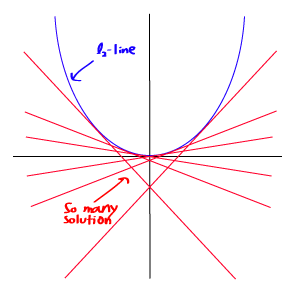
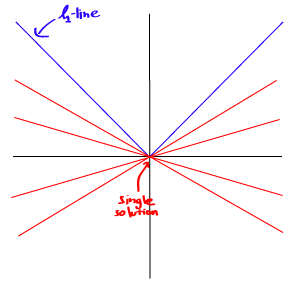

import Latex from "../../../../components/Latex.astro";

_2020 remark:
This article was first published in 2012 under the name [l0-Norm, l1-Norm, l2-Norm, … , l-infinity Norm](https://rorasa.wordpress.com/2012/05/13/l0-norm-l1-norm-l2-norm-l-infinity-norm/). It was - and still is - the most popular piece of writing in my life, with a few hundreds visits everyday. It was largely responsible for the reason I could not migrate my blogs for so many years._

I’m working on things related to norm a lot lately and it is time to talk about it. In this post we are going to discuss about a whole family of norm.

## What is a norm?

Mathematically a norm is a total size or length of all vectors in a vector space or matrices. For simplicity, we can say that the higher the norm is, the bigger the (value in) matrix or vector is. Norm may come in many forms and many names, including these popular name: _Euclidean distance_, _Mean-squared Error_, etc.

Most of the time you will see the norm appears in a equation like this:

<Latex
  formula="\left \lVert x \right \rVert"
  display
/> where <Latex formula="x" /> can be a vector or a matrix.

For example, a Euclidean norm of a vector <Latex formula="a  = \begin{bmatrix} 3 \\\ -2 \\\ 1 \end{bmatrix}"/>
is <Latex formula="\left \lVert a \right \rVert_2 = \sqrt{3^2 + (-2)^2 + 1^2} = 3.742"/>
which is the size of vector <Latex formula="a"/>.

The above example shows how to compute a Euclidean norm, or formally called an <Latex formula="l_2"/>-norm. There are many other types of norm that beyond our explanation here, actually for _every single real number_, there is a norm correspond to it (Notice the emphasised word _real number_, that means it not limited to only integer.)

Formally the <Latex formula="l_p"/>-norm of <Latex formula="x"/> is defined as:

<Latex
  formula="\left \rVert x \right \rVert_p = \sqrt[p]{ \sum_i \vert x_i \vert^p }"
  display
/> where <Latex formula="p \in \mathbb{R}" />.

That’s it! A p-th-root of a summation of all elements to the p-th power is what we call a norm.

The interesting point is even though every <Latex formula="l_p"/>-norm is all look very similar to each other, their mathematical properties are very different and thus their application are dramatically different too. Hereby we are going to look into some of these norms in details.

## l0-norm

The first norm we are going to discuss is a <Latex formula="l_0"/>-norm. By definition, <Latex formula="l_0"/>-norm of <Latex formula="x"/> is

<Latex
  formula="\left \rVert x \right \rVert_0 = \sqrt[0]{ \sum_i \vert x_i \vert^0 }"
  display
/>
.

Strictly speaking, <Latex formula="l_0"/>-norm is not actually a norm. It is a cardinality function which has its definition in the form of <Latex formula="l_p"/>-norm, though many people call it a norm. It is a bit tricky to work with because there is a presence of zeroth-power and zeroth-root in it. Obviously any <Latex formula="x>0"/> will become one, but the problems of the definition of zeroth-power and especially zeroth-root is messing things around here. So in reality, most mathematicians and engineers use this definition of <Latex formula="l_0"/>-norm instead:

<Latex
  formula="\left \lVert x \right \rVert_0 = \sum(i | x_i \neq 0)"
  display
/>

that is a total number of non-zero elements in a vector.

Because it is a number of non-zero element, there is so many applications that use <Latex formula="l_0"/>-norm. Lately it is even more in focus because of the rise of the Compressive Sensing scheme, which is try to find the sparsest solution of the under-determined linear system. The sparsest solution means the solution which has fewest non-zero entries, i.e. the lowest <Latex formula="l_0"/>-norm. This problem is usually regarding as a optimisation problem of <Latex formula="l_0"/>-norm or <Latex formula="l_0"/>-optimisation.

### l0-optimisation

Many application, including Compressive Sensing, try to minimise the <Latex formula="l_0"/>-norm of a vector corresponding to some constraints, hence called “<Latex formula="l_0"/>-minimisation”. A standard minimisation problem is formulated as:

<Latex formula="\min \left \lVert x \right \rVert_0" display /> subject to <Latex
  formula="Ax = b"
  display
/>
.

However, doing so is not an easy task. Because the <Latex formula="l_0"/>-minimisation is proven by computer scientist to be an NP-hard problem, simply says that it’s too complex and almost impossible to solve.

In many cases, <Latex formula="l_0"/>-minimisation problem is relaxed to be higher-order norm problem such as <Latex formula="l_1"/>-minimisation and <Latex formula="l_2"/>-minimisation.

## l1-norm

Following the definition of norm, <Latex formula="l_1"/>-norm of <Latex formula="x"/> is defined as

<Latex
  formula="\left \rVert x \right \rVert_1 = \sum_i \vert x_i \vert "
  display
/>
.

This norm is quite common among the norm family. It has many name and many forms among various fields, namely _Manhattan norm_ is it’s nickname. If the <Latex formula="l_1"/>-norm is computed for a difference between two vectors or matrices, that is

<Latex
  formula="SAD(x_1,x_2) = \left \Vert x_1-x_2 \right \Vert_1 = \sum \left \vert x_{1_i}-x_{2_i} \right \vert"
  display
/>
,

it is called _Sum of Absolute Difference (SAD)_ among computer vision scientists.

In more general case of signal difference measurement, it may be scaled to a unit vector by:

<Latex
  formula="MAE(x_1,x_2) = \frac{1}{n} \left \Vert x_1-x_2 \right \Vert_1 = \frac {1} {n} \sum \left \vert x_{1_i} - x_{2_i} \right \vert"
  display
/> where <Latex formula="n" /> is a size of <Latex formula="x" />,

which is known as _Mean-Absolute Error (MAE)_.

## l2-norm

The most popular of all norm is the <Latex formula="l_2"/>-norm. It is used in almost every field of engineering and science as a whole. Following the basic definition, <Latex formula="l_2"/>-norm is defined as

<Latex formula="\left \Vert x \right \Vert_2 = \sqrt{\sum_{i}x_i^2}" display />.

<Latex formula="l_2" />
-norm is well known as a Euclidean norm, which is used as a standard quantity for
measuring a vector difference. As in <Latex formula="l_1" />
-norm, if the Euclidean norm is computed for a vector difference, it is known as
a _Euclidean distance_:

<Latex
  formula="\left \Vert x_1-x_2 \right \Vert_2 = \sqrt{\sum_i (x_{1_i}-x_{2_i})^2}"
  display
/>
,

or in its squared form, known as a _Sum of Squared Difference (SSD)_ among Computer Vision scientists:

<Latex
  formula="SSD(x_1,x_2) = \left \Vert x_1-x_2 \right \Vert_2^2 = \sum_i (x_{1_i}-x_{2_i})^2"
  display
/>
.

It’s most well known application in the signal processing field is the _Mean-Squared Error (MSE)_ measurement, which is used to compute a similarity, a quality, or a correlation between two signals. MSE is

<Latex
  formula="MSE(x_1,x_2) = \frac{1}{n} \left \Vert x_1-x_2 \right \Vert_2^2 = \frac{1}{n} \sum_i (x_{1_i}-x_{2_i})^2"
  display
/>
.

As previously discussed in <Latex formula="l_0"/>-optimisation section, because of many issues from both a computational view and a mathematical view, many <Latex formula="l_0"/>-optimisation problems relax themselves to become <Latex formula="l_1"/>– and <Latex formula="l_2"/>-optimisation instead. Because of this, we will now discuss about the optimisation of <Latex formula="l_2"/>.

### l2-optimisation

As in <Latex formula="l_0"/>-optimisation case, the problem of minimising <Latex formula="l_2"/>-norm is formulated by

<Latex formula="min \left \Vert x \right \Vert_2" /> subject to <Latex formula="Ax = b" />
.

Assume that the constraint matrix <Latex formula="A"/> has full rank, this problem is now a underdertermined system which has infinite solutions. The goal in this case is to draw out the best solution, i.e. has lowest <Latex formula="l_2"/>-norm, from these infinitely many solutions. This could be a very tedious work if it was to be computed directly. Luckily it is a mathematical trick that can help us a lot in this work.

By using a trick of Lagrange multipliers, we can then define a Lagrangian

<Latex
  formula="\mathfrak{L}(\boldsymbol{x}) = \left \Vert \boldsymbol{x} \right \Vert_2^2+\lambda^{T}(\boldsymbol{Ax}-\boldsymbol{b})"
  display
/>

where <Latex formula="\lambda"/> is the introduced Lagrange multipliers. Take derivative of this equation equal to zero to find a optimal solution and get

<Latex
  formula="\hat{\boldsymbol{x}}_{opt} = -\frac{1}{2} \boldsymbol{A}^{T} \lambda"
  display
/>

plug this solution into the constraint to get

<Latex
  formula="\boldsymbol{A}\hat{\boldsymbol{x}}_{opt} = -\frac{1}{2}\boldsymbol{AA}^{T}\lambda=\boldsymbol{b}"
  display
/>

<Latex formula="\lambda=-2(\boldsymbol{AA}^{T})^{-1}\boldsymbol{b}" display />

and finally

<Latex
  formula="\hat{\boldsymbol{x}}_{opt}=\boldsymbol{A}^{T} (\boldsymbol{AA}^{T})^{-1} \boldsymbol{b}=\boldsymbol{A}^{+} \boldsymbol{b}"
  display
/>

By using this equation, we can now instantly compute an optimal solution of the <Latex formula="l_2"/>-optimisation problem. This equation is well known as the _Moore-Penrose Pseudoinverse_ and the problem itself is usually known as _Least Squares Problem_, _Least Squares Regression_, or _Least Squares optimisation_.

However, even though the solution of Least Squares method is easy to compute, it’s not necessary be the best solution. Because of the smooth nature of <Latex formula="l_2"/>-norm itself, it is hard to find a single, best solution for the problem.

In contrary, the <Latex formula="l_1"/>-optimisation can provide much better result than this solution.

### l1-optimisation

As usual, the <Latex formula="l_1"/>-minimisation problem is formulated as

<Latex formula="min \left \Vert x \right \Vert_1" /> subject to <Latex formula="Ax = b" />
.

Because the nature of <Latex formula="l_1"/>-norm is not smooth as in the <Latex formula="l_2"/>-norm case, the solution of this problem is much better and more unique than the <Latex formula="l_2"/>-optimisation.

However, even though the problem of <Latex formula="l_1"/>-minimisation has almost the same form as the <Latex formula="l_2"/>-minimisation, it’s much harder to solve. Because this problem doesn’t have a smooth function, the trick we used to solve <Latex formula="l_2"/>-problem is no longer valid. The only way left to find its solution is to search for it directly. Searching for the solution means that we have to compute every single possible solution to find the best one from the pool of “infinitely many” possible solutions.

Since there is no easy way to find the solution for this problem mathematically, the usefulness of <Latex formula="l_1"/>-optimisation is very limited for decades. Until recently, the advancement of computer with high computational power allows us to “sweep” through all the solutions. By using many helpful algorithms, namely the Convex Optimisation algorithm such as linear programming, or non-linear programming, etc. it’s now possible to find the best solution to this question. Many applications that rely on <Latex formula="l_1"/>-optimisation, including the Compressive Sensing, are now possible.

There are many toolboxes for <Latex formula="l_1"/>-optimisation available nowadays. These toolboxes usually use different approaches and/or algorithms to solve the same question. The example of these toolboxes are [l1-magic](http://users.ece.gatech.edu/~justin/l1magic/), [SparseLab](http://sparselab.stanford.edu/), [ISAL1](http://imo.rz.tu-bs.de/mo/spear/).

Now that we have discussed many members of norm family, starting from <Latex formula="l_0"/>-norm, <Latex formula="l_1"/>-norm, and <Latex formula="l_2"/>-norm. It’s time to move on to the next one. As we discussed in the very beginning that there can be any <Latex formula="l"/>-whatever norm following the same basic definition of norm, it’s going to take a lot of time to talk about all of them. Fortunately, apart from <Latex formula="l_0"/>-, <Latex formula="l_1"/>– , and <Latex formula="l_2"/>-norm, the rest of them usually uncommon and therefore don’t have so many interesting things to look at. So we’re going to look at the extreme case of norm which is a <Latex formula="l_{\infty}"/>-norm (l-infinity norm).

## l-infinity norm

As always, the definition for <Latex formula="l_{\infty}"/>-norm is

<Latex
  formula="\left \Vert x \right \Vert_{\infty} = \sqrt[\infty]{\sum_i x_i^{\infty}}"
  display
/>
.

Now this definition looks tricky again, but actually it is quite strait forward. Consider the vector <Latex formula="\boldsymbol{x}"/>, let’s say if <Latex formula="x_j"/> is the highest entry in the vector <Latex formula="\boldsymbol{x}"/>, by the property of the infinity itself, we can say that

<Latex formula="x_j^{\infty}\gg x_i^{\infty} \forall i \neq j" display />

then

<Latex formula="\sum_i x_i^{\infty} = x_j^{\infty}" display />

then

<Latex
  formula="\left \Vert x \right \Vert_{\infty} = \sqrt[\infty]{\sum_i x_i^{\infty}} = \sqrt[\infty]{x_j^{\infty}} = \left \vert x_j \right \vert"
  display
/>

Now we can simply say that the <Latex formula="l_{\infty}"/>-norm is

<Latex
  formula="\left \Vert x \right \Vert_{\infty} = \max(\left \vert x_i \right \vert)"
  display
/>

that is the maximum entries’ magnitude of that vector. That surely demystified the meaning of <Latex formula="l_{\infty}"/>-norm

Now we have discussed the whole family of norm from <Latex formula="l_0"/> to <Latex formula="l_{\infty}"/>, I hope that this discussion would help understanding the meaning of norm, its mathematical properties, and its real-world implication.

## References and further reading:

- [Mathematical Norm – wikipedia](<http://en.wikipedia.org/wiki/Norm_(mathematics)>)
- [Mathematical Norm – MathWorld](http://mathworld.wolfram.com/Norm.html)
- Michael Elad, **“Sparse and Redundant Representations : From Theory to Applications in Signal and Image Processing”** , _Springer, 2010_.
- [Linear Programming – MathWorld](http://mathworld.wolfram.com/LinearProgramming.html)
- [Compressive Sensing – Rice University](http://dsp.rice.edu/cs)

**Edit** (15/02/15) : Corrected inaccuracies of the content.
