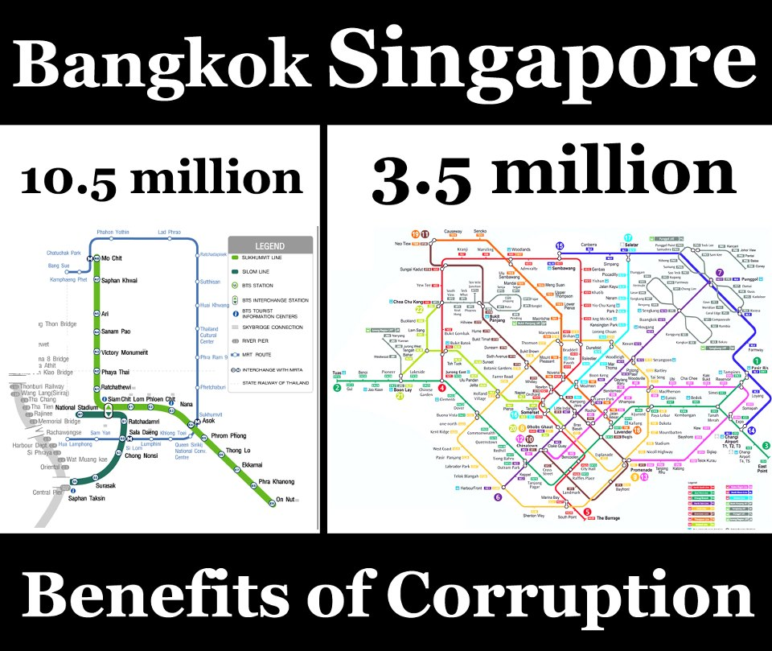

_2020 remark:
This article was first published in 2012 under the name [Why is it so easy to get a wrong idea?](https://rorasa.wordpress.com/2012/09/08/why-is-it-so-easy-to-get-a-wrong-idea/)._

I saw several of my friends shared this picture on Facebook.

This picture created by [Paul Hamon](http://paulhamon.com/), comparing a public transportation map (mostly subways) between two cities, which are Bangkok , Thailand and Singapore city (which is a country on its own).

What do you think when you see this picture? Is it obvious that Bangkok’s transport is far more expensive than Singapore’s? Is this a clear evidence of authority’s corruption?

Most of those who saw this picture suddenly said “Of course, because our politicians are so bad and they corrupt everything!” Many of them also added in more explanation already “You see!, 10.5million dollars against 3.5 million dollars, and look at what we have! They must have corrupted lots of money already.” They are so sure that the reason why Bangkok’s transportation is the way behind Singapore’s is because of their government “shared some money” between themselves. I did not say whether they are totally clean or not, or whether corruption affected any of these progresses. But the thing I want to point out is this **“Do you really think such a large train network could be cost only $3.5 million?”**

The fact is Singapore’s transport (Mass Rapid Transit) system was built with 4 billion USD initial fund [1]. That’s a magnitude higher than that in the figure. So, what is those numbers? What does this figure really mean? Well, one of the comments from Paul Hason himself reads

“Bangkok has 3 times the population and no public transport thanks to corruption.”

That’s it. Those numbers are actually numbers of population in each city. Bangkok has 10.5 million people and Singapore has 3.5 million people (which I do not know from where he got this number, I browsed through Internet and found that the current numbers are quite different from this.)

He tried to point out that the reason why Bangkok lacks of good transportation despite its large population is because of corruption. This is more like a normative reasoning and no evidence that clearly support this argument objectively. The reasons for this worse transport system could be corruption, as argued, or bad city planning, or insufficient fund, or inefficient authority, or simply because they started it later. But why we are so keen to believe that corruption is the primary source for this problem? Why we almost automatically see that Bangkok built less for more money?

According to [Daniel Kahneman](http://www.princeton.edu/~kahneman/) in his best-selling book “Thinking Fast and Slow” [2], we, human, have two levels of thinking. The first level “Fast Thinking” is based on intuitions, experiences, feeling which is more subjective and has more biases. The second level “Slow Thinking” is based on reasoning, and logic is far more objective, and more bias-free. Unfortunately, naturally, people tend to use their “Fast Thinking” to decide most of their decisions. We use this Fast Thinking on most of our daily activities. Obvious example is when we buy something because of “I like it” or we don’t trust someone because of “I hate him”. While it results in good outcomes most of the time, it doesn’t guarantee its decisions to be always correct. His researches show that Fast Thinking is very biased. Because it’s based on what we’ve learned, what we know, it makes us easily think and believe in the way we want things to be. This problem is lethal to researcher, like me, since it tends to make us believe in our idea too much, even if it’s wrong.

Fast Thinking also has an ability to try to simplify any hard problem it faces into easier one which can be answered more easily. This is the reason why when we heard about some complex stories, most people usually skip through all details and jump directly into a conclusion “based on what seems right to them.” It is also the reason why a starting impression or a starting question can guide the rest of ideas, because that starting point put a seed into people’s intuitive decisions.

Naturally, only when a problem is too hard for Fast Thinking to deal with that Slow Thinking will take its action. Slow Thinking, of course, is much slower, more logical, more reasonable, and requires lot more “processing power” of your brain (commonly speaking, “Use too much of my head”). This is the reason why people can easily take their eyes off some obvious facts and go straight into their favourable conclusions.

The reason that many of my friends automatically said that the picture in the beginning is a clear indication of corruption is based on their intuitions. They do believe that, firstly, there is severe corruption in their government, and secondly, those numbers in million digit must be money. All these ideas cloud the simple facts that there is no way such a system can be built with that amount of money, that those numbers are population, and that there is no correlation between a size of population and a size of transport system.

Bottom line – **it is much easier to believe in what we want to believe**, naturally.

And beware! Maybe all this was just something I wanted you to believe.

Reference:

- [1] Mass Rapid Transit Corporation, The MRT Story. Singapore, 1988. ISBN 981-00-0251-3.
- [2] Daniel Kahneman, Thinking Fast and Slow. Penguin Book, 2011. ISBN 987-0-141-03357-0.
