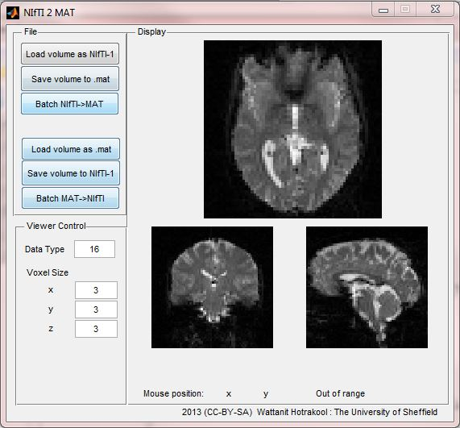

_2020 remark:
This article was first published in 2013 under the name [NIfTI 2 MAT Converter](https://rorasa.wordpress.com/2013/03/21/nifti-2-mat-converter/)._

_This software is discontinued and supports are provided no longer. However, I keep it posted here for the completion sake. It could still work given that the right version of the dependencies and Matlab Compiler Runtime are available._

This is an easy-to-use, GUI-based NIfTI <-> Matlab converter.
This program based on [The Tools for NIfTI and ANALYZE for Matlab](http://research.baycrest.org/~jimmy/NIfTI/) toolbox, written by Jimmy Shen.
Its primary function is to read [NIfTI-1](http://nifti.nimh.nih.gov/nifti-1) format files (such as .nii, .hdr and .img) and save them into Matlab .mat matrices.
It can also convert matrices back to NIfTI-1 files as well.

I wrote this small application mainly for my convenience during my own research, but I guess many people will find it useful.
This is an experimental program though, so using it at your own risk.
I will gradually improve it as time passes.
_If there is any comments or bug notices, please leave it in the comment. _

[DOWNLOAD](http://www.mediafire.com/?pin23biibwe26tf)

- This program requires Matlab Compiler Runtime (MCR) to run. If you don’t have Matlab installed on your PC, you can download the MCR from [here](http://www.mathworks.co.uk/products/compiler/mcr/)

This work is licensed under a [Creative Commons Attribution-ShareAlike 3.0 Unported License](http://creativecommons.org/licenses/by-sa/3.0/deed.en_GB).
