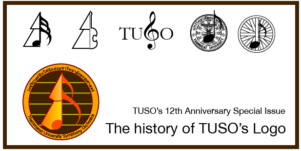
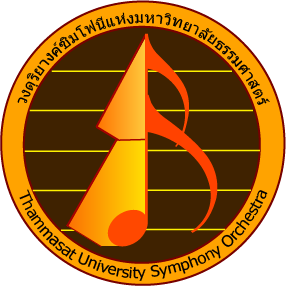
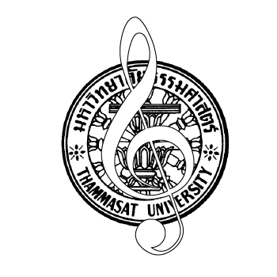
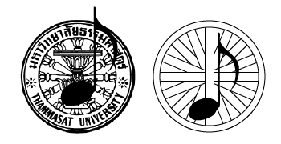
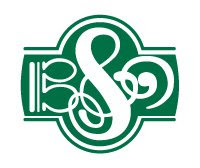
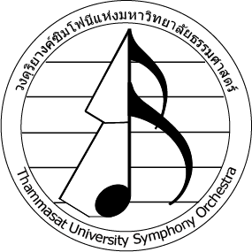

_2020 remark:
This article was first published in 2014 under the name [TUSO 12th Anniversary Special Issue – The History of TUSO’s Logo](https://rorasa.wordpress.com/2014/06/27/tuso-12th-anniversary-special-issue-the-history-of-tusos-logo/)._

_– Disclaimer: the following article is written in Thai as a special celebration for my orchestra’s 12th anniversary._

เนื่องจากวันนี้ (27 มิถุนายน 2557) เป็นวันดีเนื่องในโอกาสที่เป็นวันครบรอบ 80 ปี การก่อตั้งมหาวิทยาลัยธรรมศาสตร์ อีกทั้งยังเป็นวันครบรอบ 12 ปีของการก่อตั้ง Thammasat University Symphony Orchestra อย่างเป็นทางการ (จากนี้ไปจะเรียกว่า TUSO แทนเพื่อความสะดวกและรวดเร็ว) ผู้เขียนจึงจะขอเฉลิมฉลองวาระการอายุครบหนึ่งรอบของ TUSO ในครั้งนี้ด้วยการชวนเล่าถึงอดีตกัน โดยอดีตที่จะเล่าถึงนั้นก็คือจุดกำเนิดของโลโก้วงที่อยู่มาอย่างยาวนานนั่นเอง

เชื่อว่าคงไม่มีแฟนๆและสมาชิกคนไหนของ TUSO ไม่ว่าจะหน้าเก่าหรือหน้าใหม่ ที่ไม่เคยเห็นหรือรู้จักตราสัญลักษณ์ประจำวงอันนี้

โลโก้นี้เป็นโลโก้ที่ผู้เขียนวาดขึ้น สมัยที่ยังดำรงตำแหน่งเป็นคณะกรรมการชุมนุมฝ่ายประชาสัมพันธ์ควบหัวหน้าฝ่ายสื่อสิ่งพิมพ์ (สมัยผู้เขียนเพิ่งเข้ามหาวิทยาลัยได้ปีแรก) โลโก้นี้ถูกใช้งานครั้งแรกนับตั้งแต่สมัยคอนเสิร์ตประจำวงครั้งที่ 4 (The 4th TUSO Concert) มาจนถึงคอนเสิร์ตครั้งล่าสุดนี้ 11th TUSO Grandiose Concert จนถึงบัดนี้เรียกได้ว่าเกือบแปดปีแล้วที่โลโก้นี้ถูกใช้งานอย่างต่อเนื่อง ทว่าผู้เขียนเชื่อว่ามีน้อยคนนักที่รู้ว่าการเริ่มต้นของมันนั้นมาได้อย่างไร

เราจะเริ่มต้นโดยการย้อนเวลากลับไปยังจุดเริ่มต้นแห่ง TUSO เมื่อ12 ปีก่อน วงดนตรีวงหนึ่งถูกก่อตั้งขึ้นมาจากผีมือของกลุ่มคนเล็กๆกลุ่มหนึ่งในมหาวิทยาลัยซึ่งมีใจรักในการบรรเลงเพลงคลาสสิก (ซึ่งหลายๆคนก็ยังคงวนเวียนอยู่ในปัจจุบัน) วงดนตรีเล็กๆดังกล่าวมีนามว่า TU Chamber วงนี้มีประวัติศาสตร์การต่อสู้ดิ้นรนชีวิตมามาก เราจะไม่พูดถึงตำนานเหล่านั้นในวันนี้ แต่กล่าวย่อๆคือหลังจากที่ TU Chamber สามารถฝ่าฟันอุปสรรคนานับปการมาได้สำเร็จจนถึงปีที่ 3 TU Chamber ก็ได้มีการอัพเกรดตัวเองครั้งใหญ่ จากวงchamberเล็กๆมีเครื่องดนตรีไม่กี่ชิ้นมาเป็น symphony orchestra เต็มขนาด ณ เวลานี้นี่เองที่ TU Chamber กลายมาเป็น TUSO พร้อมทั้งจัดตั้งเป็นชุมนุมดุริยางค์สากลแห่งมหาวิทยาลัยธรรมศาสตร์อย่างเป็นทางการ

สิ่งหนึ่งที่ยังขาดอยู่ในขณะอัพเกรดวงคือโลโก้ประจำวง สมัยนั้น TU Chamber มีโลโก้อยู่หน้าตาประมาณนี้ (วาดจากความทรงจำของผู้เขียน)

นี่คือโลโก้ที่ TU Chamber ใช้ในการประชาสัมพันธ์ตัวเองในสื่อ ส่วนเอกสารทางการต่างๆก็จะใช้ตรามหาวิทยาลัยไป ทีนี้มีเหตุจำเป็นหลายอย่างผลักดันให้มีการจัดทำโลโก้ใหม่ ได้แก่ 1. อ.ศักดิพล (หรือพี่ปิ๊ก ซึ่งตอนนี้เปลี่ยนชื่อเป็นวชิรวิชญ์แล้ว) music director ของวงเห็นว่าวงควรมีโลโก้ถาวรเพื่อใช้ในการติดต่อขอสปอนเซอร์จากเอกชน 2. ทางมหาวิทยาลัยไม่อนุญาตให้ชุมนุมต่างๆใช้โลโก้ของมหาวิทยาลัยในกิจการของชุมนุม และ 3. โลโก้ชุมนุมเป็นหนึ่งในสิ่งที่ต้องมีตามระเบียบการนักศึกษาของมหาวิทยาลัย ด้วยเหตุผลดังกล่าวนี้ประธานชุมนุม ณ เวลานั้น (พี่โดนัท) จึงได้สั่งให้มีการพัฒนาโลโก้ใหม่ขึ้นมา โดยมีผู้เขียนเป็นผู้รับผิดชอบ

ไอเดียเริ่มแรกเลยก็คือการใช้ธรรมจักรเป็นพื้นฐาน เหมือนกับโลโก้มหาวิทยาลัยและโลโก้ที่เคยใช้อยู่เดิม

แต่เห็นได้ชัดว่ามันรกตามากๆ ดูแล้วไม่สบายตาเลยแม้แต่น้อย ไอเดียนี้ทั้งตระกูลเลยถูกปัดทิ้งไป

อีกไอเดียหนึ่งที่คนให้ความสนใจกันมากคือการทำเป็นโลโก้ตัวอักษรโดยใช้สัญลักษณ์ทางดนตรีเป็นพื้นฐาน ไอเดียนี้เป็นที่ชื่นชอบกันมาก (เชื่อว่าหลายๆคนจนถึงยุคนี้ก็ยังอยากได้อะไรเช่นนี้) เพราะได้รับอิทธิพลมาจากวงดนตรีชื่อดังของไทย Bangkok Symphony Orchestra (BSO)

หลายๆคนก็เลยอยากได้โลโก้ที่มีสัญลักษณ์ทางดนตรีแบบนี้บ้าง

ปัญหาก็คือสมัยนั้นบรรดานักดนตรีทั้งหลายชอบน้อยใจกัน เวลาที่สัญลักษณ์ของตัวเองไม่ถูกนำไปใช้เหมือนของคนอื่นก็มักจะน้อยใจ (เช่น “ทำไมมีแต่กุญแจซอลล่ะ และกุญแจฟาหายไปไหน”) งานนี้ต้องนับว่าผู้เล่นกุญแจอัลโต้เช่นวิโอล่าน่าสงสารที่สุด เนื่องด้วย TUSO ไม่ใช่ BSO ผู้เขียนต้องยอมรับว่าไม่ว่าจะพยายามคิดยังไงก็หาทางใส่กุญแจอัลโต้ลงไปไม่ได้จริงๆ ความเห็นแบบเดียวกันเกิดขึ้นอีกครั้งเมื่อโลโก้มีรูปเครื่องสายแต่ไม่มีรูปเครื่องเป่า

ดีไซน์ที่สามเป็นความพยายามที่จะเปลี่ยนสัญลักษณ์ของมหาวิทยาลัยจากธรรมจักรมาเป็นโดม ตัวผู้เขียนขอบไอเดียนี้มากเพราะการใช้โดมเป็นสัญลักษณ์ให้ความรู้สึกเป็นกันเองและใกล้ชิดกว่าธรรมจักร แถมยังไม่รกตาเท่าด้วย อีกทั้งยอดโดมที่ชี้ขึ้นฟ้าเหมือนลูกศรยังเป็นเหมือนแรงผลักดันให้วงพัฒนาต่อไป แต่เช่นเคยผู้เขียนเกรงกว่าการจะใส่ทั้งเครื่องสาย เครื่องลมไม้ เครื่องทองเหลือง เปอร์คัสชั่น ลงไปในโลโก้จะเป็นการกระทำที่บ้าเลือดเกินไป

บทเรียนจากดีไซน์สองและสามทำให้เรียนรู้ว่าโลโก้ต้องเป็นอะไรที่เป็นตัวแทนของทุกคนได้ เลยต้องคิดหาสัญลักษณ์ที่เป็นกลางต่อทุกคนมาใช้ ตัวโน้ตคือสัญลักษณ์ถัดไปในลิสต์ซึ่งแน่นอนว่าเป็นสิ่งที่ทุกคนมีเหมือนกันแน่ๆ ประกอบกับบรรดาสมาชิกในยุคนั้นชอบพูดกันเล่นๆว่า TUSO ไม่มีวันเล่นเพลงที่มีโน้ตช้ากว่าเขบ็ด ทำให้เกิดเป็นดีไซน์ถัดไป

ให้อารมณ์แบบว่า “ชอบเร็วๆนักก็เอาเขบ็ดสามชั้นไปเลยละกัน” จริงๆแล้วดีไซน์นี้ตอนวาดในกระดาษผู้เขียนรู้สึกว่ามันน่าเกลียดมาก แต่ก็ตัดสินใจเอาไปทำเป็นกราฟฟิกจริงจังอยู่ดีเผื่อไว้ ปรากฏว่าพอทำไปทำมาแล้วมันออกมาดีกว่าที่คิดไว้มาก หลังจากผ่านการปรับแต่งอยู่ระยะหนึ่งสุดท้ายแล้วโลโก้ปัจจุบันของ TUSO ก็ปรากฏโฉมออกมา

จะเห็นได้ว่าโลโก้ของ TUSO นี้เป็นโลโก้ที่ออกแบบมาโดยคำนึงถึงความเป็นอันหนึ่งอันเดียวและความเท่าเทียมกันของทุกคนในองค์กรเป็นหัวใจสำคัญ ตัวผู้เขียนเชื่อว่าคุณสมบัติดังกล่าวเป็นสิ่งสำคัญยิ่งสำหรับโลโก้ของวงดนตรีประจำมหาวิทยาลัยที่–อย่างน้อยก็อ้างว่า–เชื่อมั่นในเสรีภาพและความเสมอภาคของทุกคน ในวาระที่ TUSO มีอายุครบ 12 ปีแล้วตัวผู้เขียนก็หวังว่าแฟนๆและสมาชิกของ TUSO ทุกคนจะใช้ความเป็นหนึ่งเดียวกันและเท่าเทียมกันผลักดัน TUSO ให้เดินหน้าพัฒนาต่อไปอย่างไม่หยุดยั้ง ดั่งเช่นที่ตราสัญลักษณ์ประจำชุมนุมอันนี้สื่อความนัยไว้

ผู้เขียนเพิ่งพบว่าโลโก้ของ TUSO มีอยู่บน [Thai Logo Lover](http://thailogolover.blogspot.co.uk/2011/02/tuso-thammasat-university-symphony.html) ด้วย ต้องขอแสดงความขอบคุณมา ณ ที่นี้
