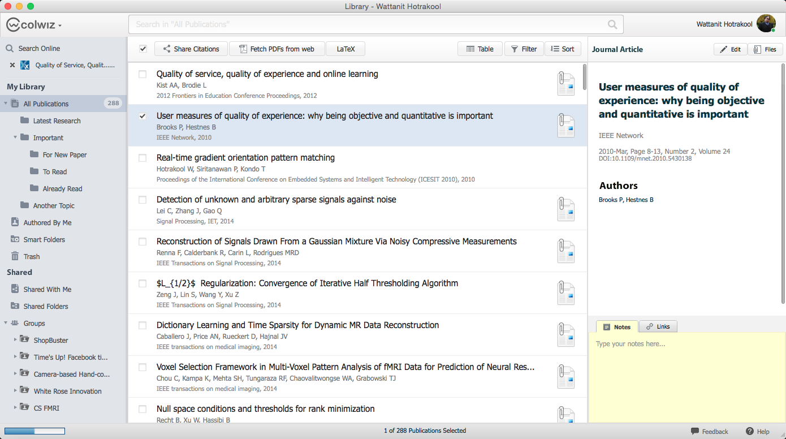
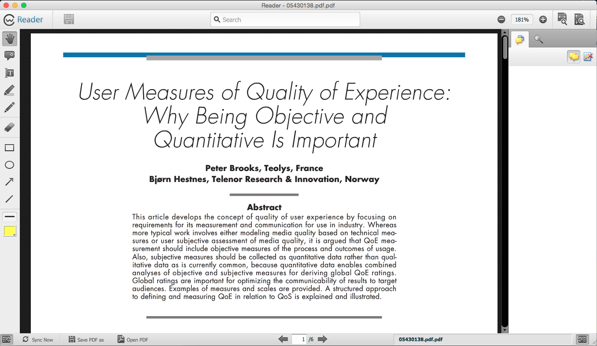
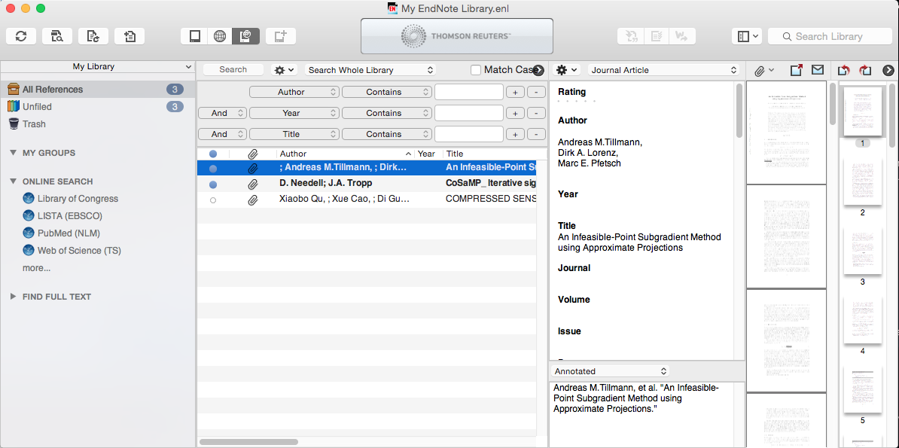
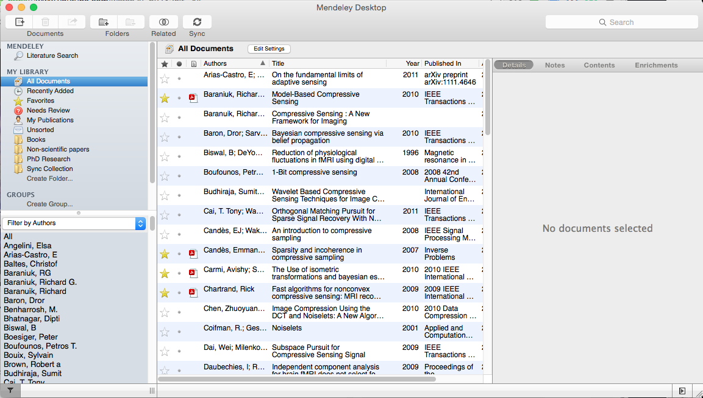
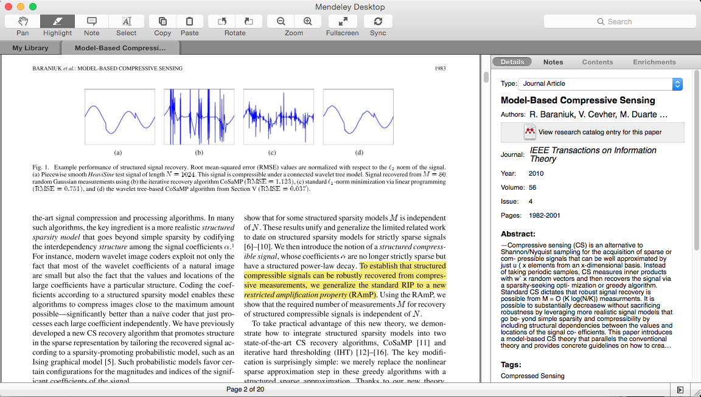
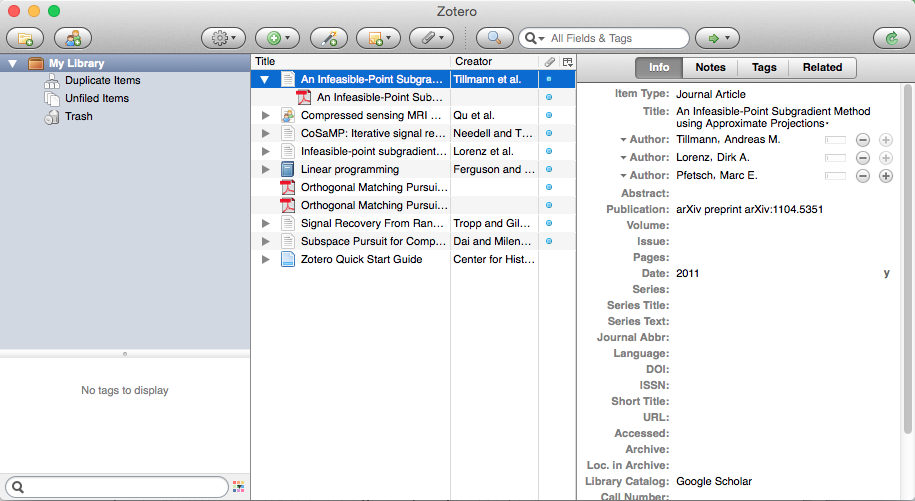
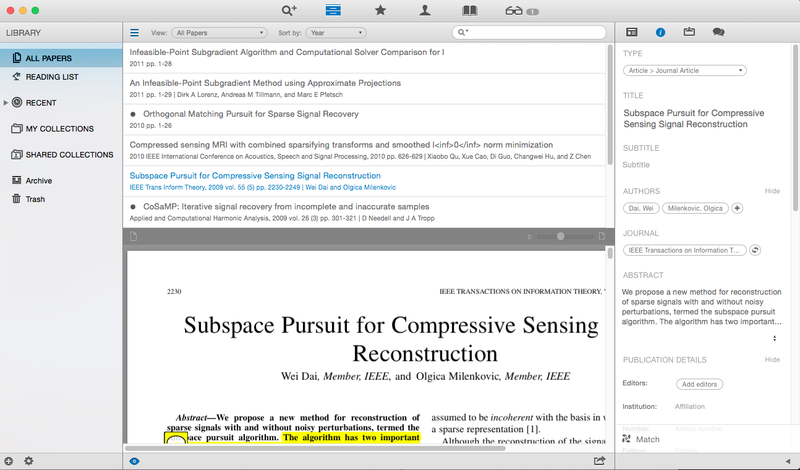
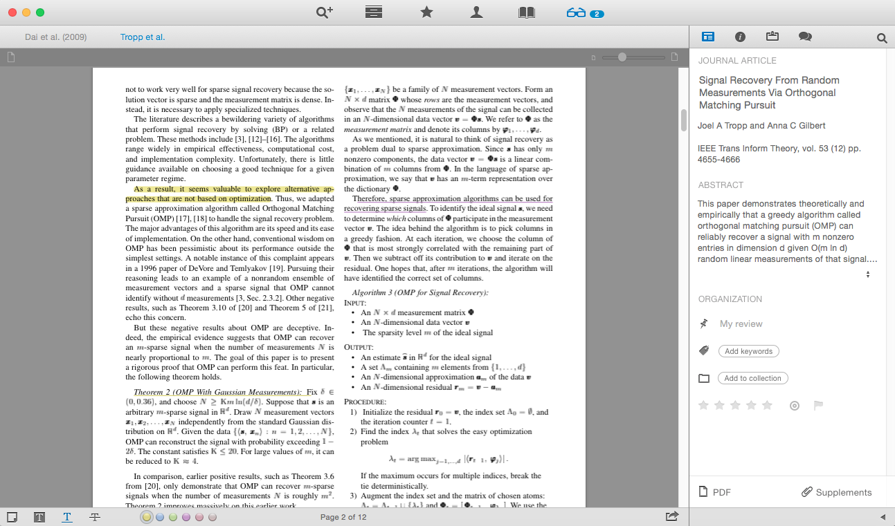
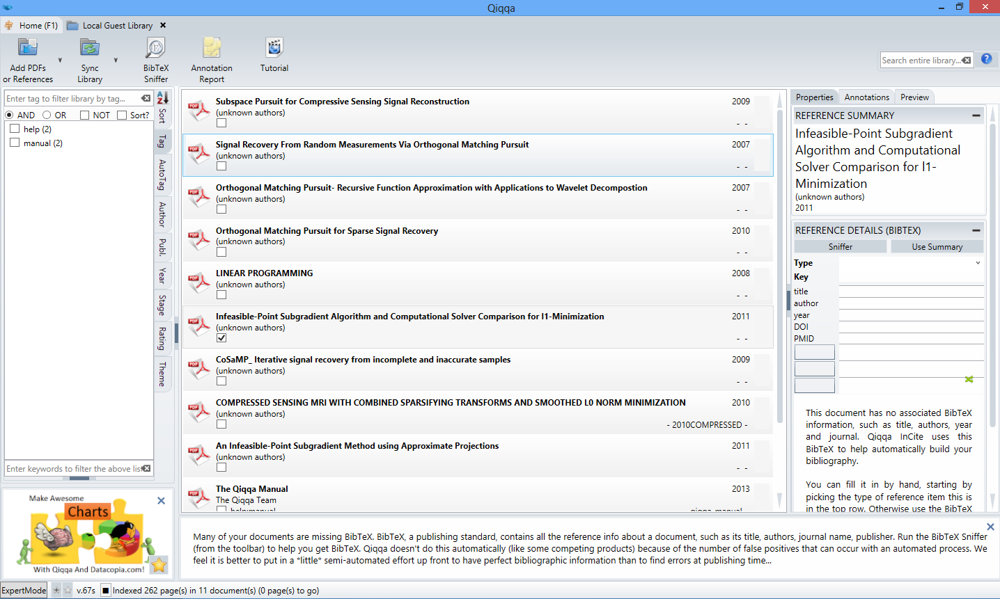
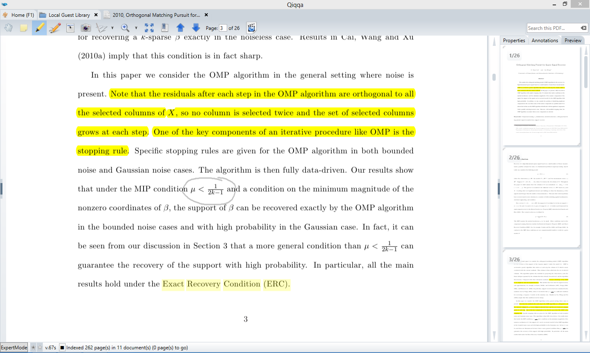

_2020 remark:
This article was first published in 2014 under the name [Which reference manager software is best for you? [2014 edition]](https://rorasa.wordpress.com/2014/10/21/which-reference-manager-software-is-best-for-you-2014-edition/)._

I was having a problem with my reference manager. When I realised it takes too much time using it than do things manually, it’s a good signal that it’s time for a change. The trouble is there are many reference managers available; how can I know which one will work best for me? This article will explore pros and cons of several popular reference manager softwares in the market.

## What is a reference manager?

What is a reference manager? Reference manager is a software that has the primary function to organize lists of references. It is an essential tool for researchers, writers, and many other professions. This is especially important if you are working with a large research project involving lots of references. Or if you have a very big collection of papers.

### Points to be considered

Each reference manager softwares are evaluated in the following points:

1. Platform supported
2. Browser integration tools
3. Mobile app supported
4. Interface design/User experience
5. Reliability/ Bugs
6. Built-in article search system
7. Build-in PDF viewer/editor
8. Other “gizmos” (aka special functionalities)
9. Ability to work offline
10. Sync/ Cloud storage
11. Pricing

## Reference Manager Softwares

### [Colwiz](http://www.colwiz.com/)

**Website: http://www.colwiz.com/**

**Review version: 2.13**

This is the reference manager I was using. The good things about Colwiz is that it’s created by people who truly understand research. The design of the library, search system and everything provides a good flow for working. Unfortunately, its desktop version is based on the obsolete, no-longer-supported Adobe Air. This creates lots of stability issues. More often than not, the program throws unexpected errors, failed to sync with servers, etc. You probably have to do the same thing several times before it successfully records your doing. Let’s hope they will move away from Adobe Air soon.

#### Pros

- Available for all platforms (Windows, Mac, Linux)
- Both iOS and Android app available
- Browser integration tool available for all major browsers
- Clean and easy to understand interface
- Good multi-source built-in search system
- Build-in PDF viewer/editor
- Offers web services that far superior than others, including dedicated calendar, task scheduler, cloud storage for research projects
- Free 3GB cloud storage (shared with web services) and the total of 5000 entries

#### Cons

- Adobe Air creates big instability issues
- Frequently fails to connect to server
- Cannot work in offline mode
- All files are stored on server and offer no direct access to files without export them

#### Conclusions

Colwiz should be a very good all-rounder reference manager software with various platform supports. It offers vast free storage space which should suite many people. Unfortunately, it is currently full of bugs and lacks of reliability. Once this issue is addressed Colwiz will become one of the best research tools in existence.

### [EndNote](http://endnote.com/)

**Website: http://endnote.com/**

**Review version: EndNote X7**

EndNote is the de facto industrial standard when it comes to reference manager software. Its main barriers are its price and its user unfriendliness. However, because EndNote is so popular, many institutions subscribe EndNote licenses for their members. If you are a university member, changes are that you might already have access to it. Your only job is to learn how to use it. (It’s the only tool in this list I think it requires learning.) If you don’t have it yet and don’t want to pay a big sum of money for it, there is [EndNote Basic](https://endnote.com/product-details/basic/) – web-based, reduced-functionality version – for free.

#### Pros

- Available for Windows/ Mac
- Clean interface
- Very solid, bug-free, reliable
- Easy to find supports and helps
- uilt-in search system covers hundreds of catalogues (even though many popular databases are missing)
- Can work completely offline

#### Cons

- Only iOS app available
- No browser integration tool
- Extremely lack of automatic processes (for adding new article, extracting META, auto-categorisation etc.)
- Interface is confusing and highly unintuitive – need user manual to work around
- No built-in PDF viewer
- Sync requires a separate EndNote Online subscription. 2 years subscription comes with your EndNote license
- Desktop license costs $245.95 for downloadable version. iPad app costs $3.99

#### Conclusions

Despite EndNote is the industrial standard of reference manager software, its functionality is quite smaller compared to other tools available. It is quite user unfriendly so you might need to learn how to use it first instead of jump right in. Move over, its price tag is expensive unless you already have access to it via your institution.

### [Mendeley](http://www.mendeley.com/)

**Website: http://www.mendeley.com/**

**Review version: 1.12**

Mendeley is one of the popular reference manager software together with EndNote and Zotero. Like EndNote, many databases provide direct export function to Mendeley database. Unlike EndNote, Mendeley is designed to work with cloud database. To use its full capability, your entire database has to be uploaded to its cloud. Mendeley also has its own research tool called Mendeley catalogue that provides paper discovery, insight, and collaboration services.

#### Pros

- vailable for all platforms (Windows/Mac/Linux)
- Clean and easy-to-understand interface
- Very stable and reliable
- Built-in PDF viewer/editor
- Mendeley catalogue provides paper discovery, insights, and collaboration
- Offers 2GB free cloud storage space for library sync.

#### Cons

- Only iOS app available
- No browser integration tool
- Built-in search only support Mendeley catalogue
- Poor META data accuracy
- Cannot work offline
- Storage plan starts from $4.99 per month for 5GB cloud space

#### Conclusions

Mendeley is a very reliable reference manager even though it’s short in terms of search function and META extraction. Its free cloud storage is quite big for most people, but if it’s not enough the price is relatively high.

### [Zotero](https://www.zotero.org/)

**Website: https://www.zotero.org/**

**Review version: 4.0**

Also one of the popular reference manager softwares, Zotero is originally developed as an extension for Firefox. Currently there is a stand-alone desktop version for Zotero which makes become a decent tool. Despite its limited functionality, Zotero is more light-weighted and easier to learn than many tools.

#### Pros

- Available for all platforms (Windows/Mac/Linux) plus Firefox extension version
- Browser integration tool for easy importing, available for Chrome, Firefox, Safari
- Clean and easy to use interface
- Desktop program is fast and fluid, bug-free and reliable
- Can work in offline mode
- Sync system has separate data sync (library, META) and file sync (PDFs)
- Data sync is completely free of charge. Free 300MB storage is available for file sync

#### Cons

- No mobile apps available
- No built-in PDF viewer/editor
- No built-in search engine – but do have the automatic META retriever
- Cloud storage package starts from $20 per year for 2GB space

#### Conclusions

Zotero is a very fast and reliable reference manager software. It is a reference manager is its essence; easy-to-use, light-weighted, and no fancy functionality. Zotero is the best for those looking for pure reference manager but nothing else.The only short coming is the limited cloud storage space. This plus its moderate price might not be suitable for those who want to put their big library on the cloud.

### [Papers](http://www.papersapp.com/)

**Website: http://www.papersapp.com/**

**Review version: 3.1**

Papers is a famous reference manager among Mac users for years. Its strong point is its user interface that is probably the best in this list. It is very pleasant to use Papers in your everyday research. There are some catches though. Papers is purely designed to work with a local library and files. The only cloud/sync mechanism of Papers has depends on Dropbox. That means if you need to put a big library on the cloud you might need to update your Dropbox account. You also needs a license for your desktop program as well.

#### Pros

- Available for Mac/Windows/Web version
- Browser bookmarklet for easy importing
- The best-designed interface
- Stable and bug-free
- Built-in search from 25 databases
- Built-in PDF viewer/editor
- Built-in web browser
- Related articles suggestion
- Social network capability
- Work completely offline

#### Cons

- Only iOS app avaliable
- Lack of its own cloud/sync service
- No online capability – relies on Dropbox for syncing
- Desktop license costs $79 / Mobile version costs $9.99

#### Conclusions

Papers comes short in term of cloud service and syncing since it offers none. However, for those who don’t require or desire the cloud service, Papers offers the best experience of using reference manager software.

### Qiqqa

**Website: http://www.qiqqa.com/**

**Review version: 67s**

Qiqqa is quite an unusual reference manager + research tool compares to others in the list. Like Colwiz, it is designed by people who are researcher themselves. It provides many useful functionalities which are unique to Qiqqa, many of them are very useful for broadening your research materials. Qiqqa comes with free version and premium version, which offers many tweaking and personalise options over the free one. The most interesting of all is its cloud service. Apparently Qiqqa stores your libraries and files on Amazon servers. Amazon charges people for both upload to, download from, and storage on their servers at a very cheap rate. Unlike others in this list that sell storage space as packages, Qiqqa directly charges you the same amount it’s charged by Amazon. Doing so makes Qiqqa’s cloud storage extremely cheap compares to others.

#### Pros

- Has built-in PDF viewer/editor
- Has built-in web browser
- Discovery system – offers unique way to analyse your library
- Can work in offline mode with multiple libraries and accounts
- Offers very cheap cloud service, using pre-paid system

#### Cons

- Only available for Windows platform
- Only Android app available
- No browser integration tool
- Unintuitive user interface
- No built-in search system

#### Conclusions

Qiqqa offers very unique functionalities that can’t be found elsewhere. One of the thing about Qiqqa is its cheap cloud storage which makes it best for those who want to put a large library on the cloud. However, the unintuitive user interface might be a put-off for many users.

## What should I use then?

It all depends on what you’d expect from the reference manager softwares. Personally, if what you want is a light-weighted, easy-to-use tool for making references in your work, I’d recommend these tools: Zotero, Papers, Mendeley.

Likewise, if what you’re looking for is the complete research tool with the ability to organise, notate, discover, and suggest papers, I’d recommend Mendeley, Qiqqa, and Papers. Colwiz might worth a try if you don’t mind about bugs.

Finally, if you have a big library and want to put it on the cloud, the tools that offer big storage space might be good options: Mendeley, Qiqqa, Colwiz.

## Online alternatives

If for some reasons you feel like you don’t want to install anything on your machine, there are some web-based reference manager softwares available. Above we have seen that EndNote Basic and Papers Online are very decent online reference managers. But there are also exclusive tools that only exist in its online form.

### [RefWorks](https://www.refworks.com/)

RefWorks is a commercial, web-based reference manager software. It’s capability is very much equivalent to EndNote’s. RefWorks is in fact one of the oldest tools around. It has everything you’d need from a reference manager software. RefWorks license costs $100 and, like EndNote, many institutions subscribe it for their members.

### [CiteULike](http://www.citeulike.org/home)

CiteULike is a online reference manager system that is also a kind of integrated social network in itself. You have to add reference/citation details like other softwares. But in addition, you also have ability to share your reference list as well as write a comment on each entry for the public to see. The best thing about CiteULite is that it’s completely free to use.
