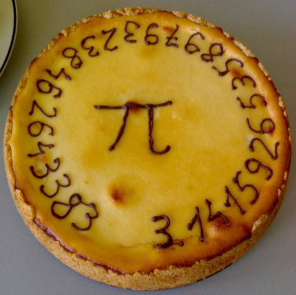

_2020 remark:
This article was first published in 2015 under the name [The most accurate Pi Day!](https://rorasa.wordpress.com/2015/03/14/the-most-accurate-pi-day/)._

Today (14 March 2015) is Pi Day!

Usually people always regard 14 March of every year as Pi Day. But Pi Day this year is very, very special.

Why?

Because this year there is a very unique opportunity to get **the most accurate Pi Day** in my life time.

The value of the irrational number Pi ($\pi$) is roughly 3.141592653589793238… and this number goes on for eternity. Normally Pi Day can be estimated up to only 2 digits: March 14 $\equiv$ 3.14 . But in 2015, this number can be matched up to 4 digits: Match 14, 15 $\equiv$ 3.1415.

If you are really serious about it, probably you can match it up to 12 digits! Keep you eyes on this:

**March 14, 15 – 09:26:53:589 $\equiv$ 3.141592653589**

(March the 14th, 2015, nine twenty-six a.m., fifty-three seconds and 589 milliseconds).

If you miss this one, you can still get a second change in the evening (though not as good since it’s in fact 21 o’clock). If you miss this second one as well, let’s hope you can live until the next century.

Happy Pi Day

P.S. You can see more digits of Pi here http://www.geom.uiuc.edu/~huberty/math5337/groupe/digits.html

