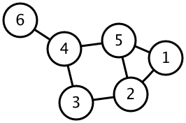
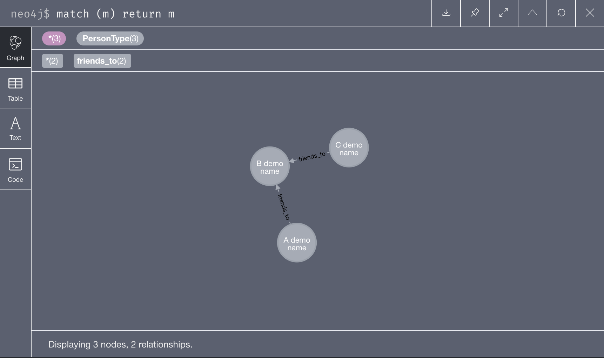
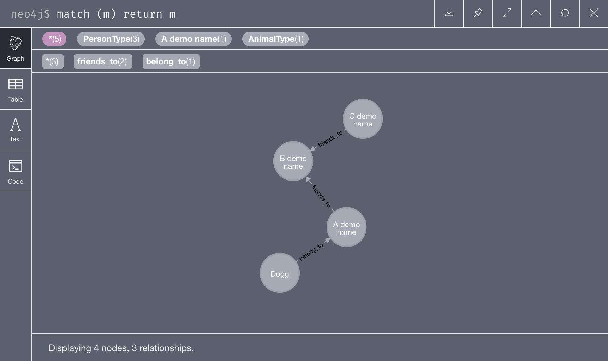
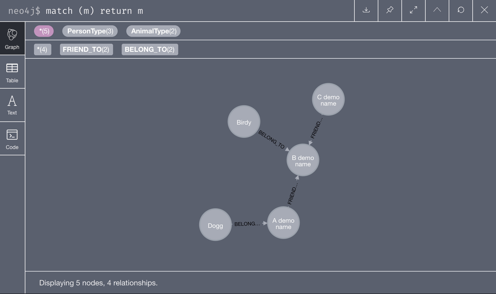

Recently I was working with a research project that revolved around the use of graph analysis techniques and graph data modelling.
To do that we were required to switch to using a new set of tools to work with, which are better suited for graph data structure.

## What graph?

Graph in the perspective of data scientists and programmers are different from what people tend to think of as graphs.
They are not 2D plots (or sometimes 3D) that show relations between things (which is technically called a chart), but rather a structure representing relationships between objects.
The graph here refers to the kind of graph talked about by mathematicians, a structure consists of objects (nodes) and their relationship (edges)



For data scientists and programmers, they take this meaning further.
To them, graph is a kind of data structure designed and optimised to represent data with relations.
Roughly speaking, to work with data, there are usually two tools in the stack involved:

1. Data storage
2. Data analysis package

For standard tubular data, the data storage could be a relational database.
The queried data is then analysed using an analysis package like [Pandas](https://pandas.pydata.org/), for example.
The same thing goes for graph data too.
For graph data, by far, the most popular analysis tool is [NetworkX](https://networkx.github.io/).
This is a very convenient package to perform analysis on any sort of network data structure, with lots of features and extensive supports for other packages.
However, when it comes to the data storage, the most popular graph database is [Neo4j](https://neo4j.com/).

Neo4j uses its matual query language called Cypher.
Personally, Cypher is very powerful and by far the most flexible way to query the complicated graph relations. (You can get started with Cypher [here](https://neo4j.com/developer/cypher-query-language/))
However, this article will show another way to work with Neo4j - via using Python programming language.

## Installing Neo4j and Py2Neo

In this quide we have chosen to use Py2Neo instead of the official Neo4j Python driver for the following reason:

1. Py2Neo has better integration with other libraries in Python data science stacks such as Pandas and Numpy.
2. Py2Neo gives a high level abstraction called Object Graph Mapping (OGM) that is really useful in terms of data modeling.

Py2Neo mostly work in-memory, however. So if you are looking for something to work with large-scale production servers, the official driver could be a better choice.

### Install Neo4j Desktop

To install Neo4j for local development, we first download and install Neo4j Desktop.
Neo4j desktop can be downloaded from https://neo4j.com/download-center/#desktop

### Install Py2Neo via pip

Simply run `pip install py2neo` at your terminal.

> **REMARK for April 2020**
>
> As the time of writing, Neo4j just launched a new major version, which is incompatible with most libraries in the standard repositories.
> Apparently the Neo4j desktop 1.2.7 comes with Neo4j Server 4.0 (changed from 3.5), which just released by the end of March 2020.
> Installing py2neo from PyPI repository (the default of pip install) will install py2neo 4.3 which only supports up to Neo4j 3.5.
> Many things will not work with py2neo 4.3 and Neo4j 4.
>
> **Temporary workaround** is to install py2neo 5 which support Neo4j 4 directly from github via
> `pip install git+https://github.com/technige/py2neo.git`

## Connecting to database

Now that we have installed Neo4j and Py2Neo, it time to get started.

Neo4j organises multiple databases as a project.
One database consists of one graph.
For Neo4j Desktop, one database (thus, one graph) can be active at a time. Active database is selected via Neo4j Desktop app.

Get the main graph - object representing the graph in the database - by providing the database URI.

```python
from py2neo import Graph, Node, Relationship
graph = Graph("bolt://localhost:7687", password="password")
```

## Node, Relationship, and Subgraph

Py2neo models graph nodes and relationships with Node and Relationship objects.
Each object can be created and operated like a regular python object.

A subgraph is a collection of nodes and relationships.
Py2Neo mainly interact with Neo4j using subgraphs.

### Create nodes and relationships

To create nodes and relationships:

```python
# Create nodes
A = Node("PersonType", name="A demo name")
B = Node("PersonType", name="B demo name")
C = Node("PersonType", name="C demo name")

# Create relationships
ab = Relationship(A,"friends_to",B, years=4)
cb = Relationship(C,"friends_to",B, years=3)
```

The first argument of Node is the node type whereas the second argument of Relationship is the relationship type.
Both Node and Relationship can have arbitrary number of _properties_.

Nodes and relationships are subgraph by themselves.
We can create a new subgraph by using standard set operations (e.g. union, intersection):

```python
# Create subgraph by union relationships
abc = ab | cb
```

Subgraph can be used to manipulate the main Graph directly or by forming into a Transaction.

```python
# create the graph using the subgraph directly
graph.create(abc)
```

All the codes above creates a graph equivalent to the result of the following Cypher statement:

```
# Cypher
CREATE (A:PersonType {name:"A demo name"})-[ab:To]->(B:PersonType {name:"B demo name"}),
       (C:PersonType {name:"C demo name"})-[cb:To]->(B)
```

The result can be viewed using Neo4j browser (open via Neo4j Desktop app) and run the following cypher query

```
MATCH (m) RETURN m
```



### Merge subgraph

New subgraph can be merge into the existing graph using the merge operation like so:

```python
# merge (update) a node and relationship into the graph
# REMARK: multiple create statements will create multiple disconnected subgraph in the main graph
D = Node("AnimalType", name="Dogg")
da = Relationship(D, "belong_to", A, years=2)
graph.merge(da, "A demo name", "name")
```

The above code is equivalent to the following Cypher statement:

```
# Cypher
MATCH (A {name:"A demo name"}) MERGE (D:AnimalType {name: "Dogg"})-[:belong_to]->(A)
```



### Delete subgraph

The subgraph could be deleted from the main graph.
There are two kind of deletion in Py2Neo: delete and separate.
Delete gets rid of both the nodes and relationships in the subgraph, while Separate only get rids of the relationships without removing the nodes.

```python
# delete a subgraph
graph.delete(da) # this deletes node A, node D and relationship da
graph.separate(abc) # this deletes relationship between ab and cb without deleting B and C
graph.delete(B) # this deletes node B and relationship cb
graph.delete(C) # this deletes node C, leaving the main graph empty
```

## Transaction

Several graph operations can be grouped together as a transaction.
Multiple operations can be performed programatically before the transaction is committed, i.e. execute on Neo4j.
Using transactions consist of three steps:

1. create a new transaction
2. perform graph operations onto transaction
3. commit the transaction to Neo4j

The direct graph operations we used previously are basically "autocommit" transaction - a transaction with only one operation that commits automatically.

```python
# Create a transaction
tx = graph.begin()
# Create a subgraph
A = Node("PersonType", name="A demo name")
B = Node("PersonType", name="B demo name")
C = Node("PersonType", name="C demo name")
ab = Relationship(A,"friends_to",B, years=4)
cb = Relationship(C,"friends_to",B, years=3)
abc = ab | cb
tx.create(abc)
# Merge a subgraph
D = Node("AnimalType", name="Dogg")
da = Relationship(D, "belong_to", A, years=2)
tx.merge(da, "A demo name", "name")
# Commit the transaction
tx.commit()

```

This transaction results the same graph we previously deleted in the previous section.

## Direct Cypher operation

Both Graph and Transaction supports run() method that take a Cypher string.

To delete subgraph using Cypher query:

```python
# delete everything again
graph.run("MATCH (m)-[r]->(n) DELETE m,r,n")
```

We can then recreate the same graph again by

```python
# Recreate everything again
graph.run("""CREATE (A:PersonType {name:"A demo name"})-[ab:To]->(B:PersonType {name:"B demo name"}),
(C:PersonType {name:"C demo name"})-[cb:To]->(B),
(D:AnimalType {name: "Dogg"})-[:belong_to]->(A)
""")
```

## Retrieving Data from Neo4j

There are two main way of retrieving data from Neo4j

1. Cursor object from Graph.run() and Transaction.run()
2. Match objects

### Cursor object

Cursor objects are the result of the run method which gives you the database cursor.

The following query

```python
# Run a query using Cypher
query_cursor = graph.run("""MATCH (b {name: "B demo name"})<-[r]-(n:PersonType) return b,r,n""")
```

will result in

```
Node('PersonType', name='B demo name')	To(Node('PersonType', name='A demo name'), Node('PersonType', name='B demo name'))	Node('PersonType', name='A demo name')
Node('PersonType', name='B demo name')	To(Node('PersonType', name='C demo name'), Node('PersonType', name='B demo name'))	Node('PersonType', name='C demo name')
```

The cursor are iterable, so we can do this:

```python
# transverse the query result using iterator and interested only in relationship
query_cursor = graph.run("""MATCH (b {name: "B demo name"})<-[r]-(n:PersonType) return b,r,n""")
for result in  query_cursor:
    print(result["r"])
```

which results in

```
(A demo name)-[:To {}]->(B demo name)
(C demo name)-[:To {}]->(B demo name)
```

Cursor.data() method will simply get everything in one big object.

```python
# view the query result in one shot
query_cursor = graph.run("""MATCH (b {name: "B demo name"})<-[r]-(n:PersonType) return b,r,n""")
print(query_cursor.data())
```

results in

```
[{'b': Node('PersonType', name='B demo name'), 'r': To(Node('PersonType', name='A demo name'), Node('PersonType', name='B demo name')), 'n': Node('PersonType', name='A demo name')}, {'b': Node('PersonType', name='B demo name'), 'r': To(Node('PersonType', name='C demo name'), Node('PersonType', name='B demo name')), 'n': Node('PersonType', name='C demo name')}]
```

Cursor can be converted to many things including ndarray, pd.Series, and a subgraph.

```python
# convert result to pd.Series
import pandas as pd
query_cursor = graph.run("""MATCH (b {name: "B demo name"})<-[r]-(n:PersonType) return n.name""")
query_cursor.to_series()

# convert result to subgraph
query_cursor = graph.run("""MATCH (b {name: "B demo name"})<-[r]-(n:PersonType) return  b,r,n""")
B_friendship = query_cursor.to_subgraph()
```

## Match Object

There are to type of match objects: NodeMatcher and RelationshipMacther.
Match object allow complex node and relationship matching and return a iterable set of matched nodes/relationships.

```python
from py2neo import NodeMatcher, RelationshipMatcher

# Match nodes with name "A demo name"
matcher = NodeMatcher(graph)
node_match = matcher.match("PersonType", name="A demo name")
for match in node_match:
    print(match)

# return
# (Dogg)-[:belong_to {}]->(A demo name)
```

```python
# Match relationship with type "belong_to"
matcher = RelationshipMatcher(graph)
rel_match = matcher.match(nodes=None, r_type="belong_to")
for match in rel_match:
    print(match)

# return
# (Dogg)-[:belong_to {}]->(A demo name)
```

## Object-Graph Mapping

Object-Graph Mapping (OGM) allows the construction of classes and objects that represent the node and relationship in Graph.

By using OGM style, the graph is now represented by a group of OGM objects.
Graph's nodes are represented by OGM objects, while relationships are represented only as OGM objects' preperties.
Note that with OGM, the graph is represented with the notions of objects so it must be approached as such. For example, there is no distinct concept between CREATE and MERGE as both are considered to be the same operation for OGM.

> For a GraphObject, create and merge are an identical operation. This is because GraphObject instances have uniqueness defined by their primary label and primary key and so both operations can be considered a form of merge. If a corresponding remote node does not exist, one will be created.

Primary key can be easily set with OGM, where the default uses in normal Neo4j is "id" (running number). Thus it is possible to set primary key to be deterministic and prevent object duplication.

### Import OGM

```python
# import GraphObject
from py2neo.ogm import GraphObject, Property, Label, RelatedTo
```

```python
# (optional) delete old data
graph.run("MATCH (m)-[r]->(n) DELETE m,r,n")
graph.run("MATCH (m) DELETE m")
```

### Create OGM classes

We can create OGM classes by extending GraphObject class.

```python
# Create OGM
class PersonType(GraphObject):
    __primarykey__ = "name"

    name = Property()  # node property
    isChild = Label() # boolean "tag"

    friend_to = RelatedTo("PersonType")

    def __init__(self, name):
        self.name = name

    def addFriend(self, friend, years=0):
        self.friend_to.add(friend, {"years": years})

class AnimalType(GraphObject):
    __primarykey__ = "name"

    name = Property()

    belong_to = RelatedTo("PersonType")

    def __init__(self,  name):
        self.name = name

    def addOwner(self, owner, years=0):
        self.belong_to.add(owner, {"years": years})
```

### Create graph

Once the OGM classes are defined, we can simply create the graph by first create the objects:

```python
# create OGM objects
A = PersonType("A demo name")
B = PersonType("B demo name")
C = PersonType("C demo name")
D = AnimalType("Dogg")
```

Then add the relationship using the object's method:

```python
# Add relationship
A.addFriend(B, years=4)
C.addFriend(B, years=3)
D.addOwner(A, years=2)
```

THen we can simply insert each object into the main graph:

```python
# Create graph
graph.create(A)
graph.create(B)
graph.create(C)
graph.create(D)
```

To add more object is trivial:

```python
# Add more node
E = AnimalType("Birdy")
E.addOwner(B, years=1)
graph.create(E)
```



OGM can also be used to match the object in the main graph too.

```python
# Match object in graph
target = PersonType.match(graph, "A demo name")
for node in target:
    print(node)
```

results in

```
<PersonType name='A demo name'>
```

## Conclusions

Py2Neo gives an ability of interact with Neo4j easily with high flexibility.
This introduction is by no means completed.
For all the features of Py2Neo, please check out its [official documentation](https://py2neo.org/v5/).
