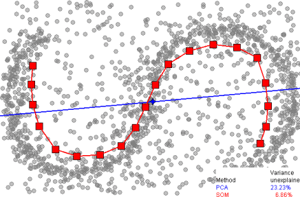
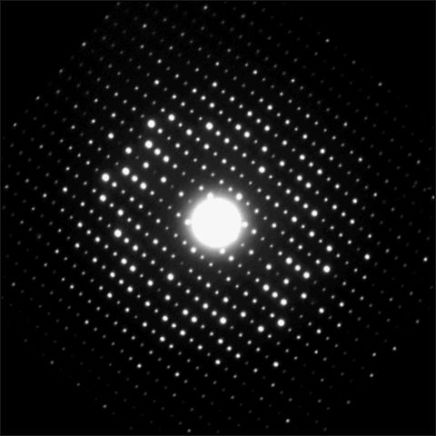
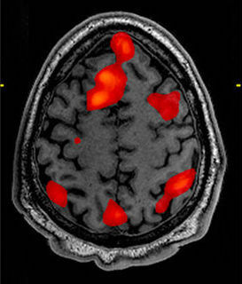

## Activity-based Credit Scoring for Microfinance Loans

Credit score is an important tool for banks when issuing loans to their customers. However, the rise of the microfinance loans recently - small loans targetting customers when low or no credit record - has led to the situation where traditional expert-opinion based loan decision is too costly to operate. By knowing their activity - financial and physical - it is possible to predict their credit worthiness to make an automatic loan decision at scale with minimum cost and risk.

## Human behavioral analysis from high dimensionality features

While it is true that human behaviors and emotions cannot be easily measured and evaluated, it is possible to find correlation between human behaviors and a lot of of small, seemingly uncorrelated, features. These features could be easily measured using assorted range of sensors for a wide variety of applications, most notable one being the data-driven market research.

This project has finished in 2019.

## Automatic photo gallery summarisation using machine learning

One of the challenges in today where cameras are readily available is that the amount of photos taken is phenomenal. The gallery summarisation algorithms summarise the photographs based on various low-level image features such as colour, texture, tone, as well as high-level features such as object recognition and scene understanding.

## Automatic tracking of X-ray diffraction pattern

Analysis of X-ray diffraction pattern is a very useful method in Crystallography. However, in order to analyse the pattern accurately, the location of each diffracted beam must be tracked. This project developed a novel beam tracking methods based on object tracking algorithms which can cope with the challenges of beam distortion and occlusion in real applications.

This project has finished in 2017.

## Evaluation of Sensing and Computer Vision Techniques for Recycling Industry

Recycling industry is one of the most challenging applications for computer vision techniques. Unlike other popular applications such as face recognition, the environment of the recycling plant and the characteristic of the recyclable objects are extremely hard to define. This project addressed a set of particular vital challenges for the current recycling technologies.

This project has finished in 2016.

## Compressed Sensing for Functional Magnetic Resonance Imaging (fMRI)

Functional Magnetic Resonance Imaging is a popular non-invasive tool for the study of brain activity. By incorporating the compressed sensing, a novel signal processing technique, the performance of the fMRI can be vastly improved. This was a PhD project which had been conducted between 2011--2016.

The thesis of this project is publicly available on White Rose eTheses Online.

This project has finished in 2016.

## Automatic Eye Tracking for Eye Surgery Microscope

Manual microscope control has always been inconvenient whenever an ophthalmologist has to perform the eye surgery. This project proposes a novel eye tracking technique designed especially for incorporating into the autonomous microscope, providing the ability to track and follow the movement of the subject’s eye without the input of the ophthalmologist.

This project has finished in 2010.

---

# Selected publications

- Wattanit Hotrakool, Charith Abhayaratne, **"Referenced compressed sensing for accurate and fast spatio-temporal signal reconstruction"**, _Journal of Electronic Imaging Vol.28 Issue. 4, 2019_.

- Wattanit Hotrakool, Charith Abhayaratne, **"Towards baseline-independent analysis of compressive sensed functional magnetic resonance image data"**,_22nd IEEE International Conference on Digital Signal Processing (DSP), 2017_.

- Wattanit Hotrakool, **"Compressed sensing for functional magnetic resonance imaging data"**, _Ph.D. Thesis, University of Sheffield, 2016_.

- Wattanit Hotrakool, Charith Abhayaratne, **"An optimal learning parameter for running Gaussian-based referenced compressive sensing"**, _2nd IET International Conference on Intelligent Signal Processing 2015 (ISP), 2015_.

- Wattanit Hotrakool, Charith Abhayaratne, **"Efficient reconstruction of functional magnetic resonance imaging (fMRI) data from compressive measurements based on correlated reference"**, _10th IMA International Conference on Mathematics in Signal Processing, 2014_.

- Wattanit Hotrakool, Charith Abhayaratne, **"Running Gaussian reference-based reconstruction for video compressed sensing"**, _IEEE International Conference on Acoustics, Speech and Signal Processing (ICASSP), 2014_.

- Wattanit Hotrakool, Charith Abhayaratne, **"Fast compressed sensing reconstruction using the least squares and signal correlation"**, _IET Intelligent Signal Processing Conference 2013 (ISP 2013), 2013_.

- Wattanit Hotrakool, Prarinya Siritanawan, Toshiaki Kondo, **"A real-time eye-tracking method using time-varying gradient orientation patterns"**, _ECTI-CON2010: The 2010 ECTI International Confernce on Electrical Engineering/Electronics, Computer, Telecommunications and Information Technology, 2012_.

- Wattanit Hotrakool, Prarinya Siritanawan, Toshiaki Kondo, **"Real-time gradient orientation pattern matching"**, _International Conference on Embedded System and Information Technology, 2010_.
